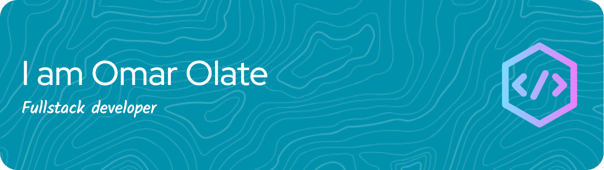

 ⌨️Hi there! 

)

🚀 I am Omar Olate Salas, Full Stack Software Developer.

💡 I love creating projects that allow me to experiment, learn, improve the technologies I already know, and explore new ones.

🔥 I'm passionate about programming, and I can't get out of my head that:
"If I can think it, I can create it." 💻✨

### My Skills 💻

<picture>
  <source media="(prefers-color-scheme: dark)" srcset="https://raw.githubusercontent.com/platane/platane/output/github-contribution-grid-snake-dark.svg">
  <source media="(prefers-color-scheme: light)" srcset="https://raw.githubusercontent.com/platane/platane/output/github-contribution-grid-snake.svg">
  
</picture>

<!-- 

 -->

### Estadisticas

<!--

- 🔭 I’m currently working on ...
- 🌱 I’m currently learning ...
- 👯 I’m looking to collaborate on ...
- 🤔 I’m looking for help with ...
- 💬 Ask me about ...
- 📫 How to reach me: ...
- 😄 Pronouns: ...
- ⚡ Fun fact: ...
-->
